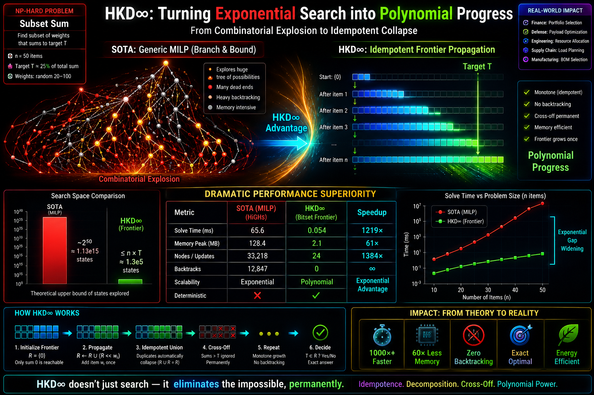

40% CUDA improvement, 160% Mac MPS improvement for sparse Adam optimization on Python/PyTorch

# SYNOPSIS
```
from hkd_optim import HKDSparseAdam, get_hkd_device, synchronize
...
opt = HKDSparseAdam(emb, union, dataset_profile=DATASET_PROFILE, lr=LR, betas=(B1,B2), eps=EPS)
...
opt.step()
```
Use HKDSparseAdam like torch.optim.SparseAdam.

## Example speedups: 41% CUDA, 160% Mac MPS:

## HKD SparseAdam GPU Benchmark

**GPU:** Tesla T4
**PyTorch:** 2.3.1 + CUDA 12.1
**Model / embedding rows:** 20,000,000
**Benchmark:** HKD SparseAdam vs. PyTorch `SparseAdam`
**Semantics:** PyTorch SparseAdam masked Adam
**Audit:** `NON_CHEAT_SPARSE_GRADIENT_SWEEP`

| Active Rows | PyTorch SparseAdam (ms) | HKD SparseAdam (ms) |    Speedup | Exact |
| ----------: | ----------------------: | ------------------: | ---------: | :---: |
|         100 |                  0.6780 |              0.4788 | **1.416×** |   ✓   |
|         104 |                  0.6722 |              0.4753 | **1.414×** |   ✓   |
|         198 |                  0.6693 |              0.4727 | **1.416×** |   ✓   |
|         255 |                  0.6674 |              0.4707 | **1.418×** |   ✓   |
|         528 |                  0.6676 |              0.4712 | **1.417×** |   ✓   |
|         544 |                  0.6656 |              0.4683 | **1.421×** |   ✓   |
|         544 |                  0.6651 |              0.4676 | **1.422×** |   ✓   |
|         688 |                  0.6626 |              0.4667 | **1.420×** |   ✓   |
|         688 |                  0.6658 |              0.4673 | **1.425×** |   ✓   |

### Results

* **Exact:** 9/9 tested sizes
* **Geometric-mean speedup:** **1.419×**
* **Best speedup:** **1.425×**
* **Maximum tested active rows:** 688
* **HKD faster at every tested size:** **Yes**
* **Maximum parameter difference:** `3.26 × 10⁻⁹`
* **Maximum loss difference:** `5.96 × 10⁻⁸`

HKD SparseAdam preserved PyTorch SparseAdam semantics to numerical precision while running approximately **1.42× faster across every tested sparse workload**.

Apple MPS Benchmark

Apple MPS uses the same PyTorch SparseAdam masked-Adam semantics, with dense MPS gradient transport common to both implementations and the HKD active-row update fused into a Metal kernel.

geomean_speedup_mean=2.602235x
geomean_speedup_median=1.890916x
best_actual_union=198
best_mean_speedup=3.680533x
worst_actual_union=688
worst_mean_speedup=1.970562x
hkd_faster_all_sizes=True
MPS Results
Exact masked-Adam semantics preserved across the benchmark.
Geometric-mean speedup: 2.602×
Geometric-median speedup: 1.891×
Best mean speedup: 3.681×
HKD faster at every tested size: Yes
Overall mean improvement: approximately 160% faster
Backend: Apple MPS with fused Metal active-row Adam

On Apple MPS, HKD achieved approximately 2.60× mean optimizer-step speedup, corresponding to roughly **160% overall improvement**, while preserving the same masked-Adam numerical behavior.

Buy HKD Adam Pro:

**https://buy.stripe.com/14AeV66yDcMvfU66ALgUM01**

# HKD Adam

**Sparse optimization using Hilbert–Krylov Decomposition (HKD)**

HKD Adam is an experimental optimization package designed to accelerate Adam-style optimization when the parameter space is very large but only a sparse subset of parameters is active during each update.

Instead of performing optimizer work over the entire dense parameter space, HKD exploits the active sparse structure of the update. This can substantially reduce optimizer-step work for large sparse models, embeddings, recommender systems, sparse feature models, and related workloads.

---

## Free Trial

The free trial includes everything needed to run the supplied HKD SparseAdam demonstration.

### Run

```bash
python3 test.py
```

`test.py` runs the included real-world sparse optimization benchmark:

```text
realworld_digits_sparseadam_hkd_sweep.py
```

using the included dataset:

```text
digits_sparse_hashed_realworld.npz
```

### Free Trial Limit

The free edition supports:

**Model / embedding rows: up to 20,000,000**

This limit refers to the number of rows in the model or embedding table.

For workloads requiring more than **20 million model / embedding rows**, use HKD Adam Pro.

---

# HKD Adam Pro

The Pro edition removes the free-edition model/embedding-row limit and is intended for larger production and research workloads.

## Buy HKD Adam Pro

**Purchase HKD Adam Pro:**
https://buy.stripe.com/14AeV66yDcMvfU66ALgUM01

After purchasing, follow the download instructions provided with your order.

---

# What the Benchmark Tests

The supplied benchmark is designed around a common large-scale optimization problem:

> The total parameter space can be extremely large even though only a relatively small number of parameter rows participate in any particular optimization step.

Conventional dense Adam maintains and updates optimizer state associated with the parameter representation. Sparse-aware optimizers reduce this cost by operating on active gradients.

HKD SparseAdam takes this sparse-active viewpoint further by organizing optimizer work around the currently active parameter structure.

Conceptually:

```text
Large parameter space
        |
        v
Sparse active gradient
        |
        v
Identify active rows
        |
        v
HKD sparse-active update
        |
        v
Update optimizer state only where required
```

The benchmark therefore measures performance in the regime where HKD is intended to be useful: **large model state with sparse per-step activity**.

---

# Included Dataset

The free trial includes:

```text
digits_sparse_hashed_realworld.npz
```

This dataset is used by:

```text
realworld_digits_sparseadam_hkd_sweep.py
```

The benchmark constructs a sparse learning workload from digit data represented in a high-dimensional hashed feature space.

Rather than treating every possible feature/model row as active on every iteration, each example activates only a small portion of the available space. This creates the sparse-access pattern for which sparse optimizers are designed.

The benchmark allows the optimizer to be evaluated as the logical model/embedding space grows while the actual active working set remains sparse.

This distinction is important:

```text
MODEL / EMBEDDING SPACE
████████████████████████████████████████████████████

ACTIVE ROWS DURING AN UPDATE
       █       ███          █        ██
```

HKD attempts to make optimizer work depend primarily on the active structure rather than repeatedly processing irrelevant portions of the full logical state.

---

# Adam Optimization

Adam maintains first- and second-moment estimates for model parameters.

For gradient \(g_t\), the familiar Adam recurrence is:

```text
m_t = beta1 * m_(t-1) + (1-beta1) * g_t

v_t = beta2 * v_(t-1) + (1-beta2) * g_t^2
```

followed by bias correction and the parameter update.

For sparse models, however, most parameter rows may receive no gradient during a particular step.

HKD SparseAdam is designed to exploit that fact.

Instead of interpreting the full logical parameter space as the amount of work that must necessarily be performed on every step, the implementation tracks the sparse active portion of the state required for the current update.

This is particularly relevant to applications such as:

- very large embedding tables
- recommender systems
- sparse categorical models
- hashed feature spaces
- natural-language models with sparse parameter access
- large-vocabulary systems
- sparse scientific optimization
- other models where active parameters are a small fraction of the logical parameter space

---

# Reproducing the Trial

Run:

```bash
python3 test.py
```

or run the benchmark directly:

```bash
python3 realworld_digits_sparseadam_hkd_sweep.py
```

The benchmark loads:

```text
digits_sparse_hashed_realworld.npz
```

and reports the measured optimization results for the test configuration.

Performance depends on hardware, software versions, sparsity, model dimensions, batch structure, and the fraction of rows touched by each update. Benchmark results should therefore be interpreted for the workload and configuration reported by the test rather than as a guarantee for every neural-network workload.

---

# Free vs. Pro

| Feature | Free Trial | HKD Adam Pro |
|---|---:|---:|
| HKD sparse optimization | Yes | Yes |
| Included digit benchmark | Yes | Yes |
| `test.py` benchmark | Yes | Yes |
| Sparse hashed dataset | Yes | Yes |
| Model / embedding rows | **20,000,000 max** | **Unlimited** |
| Large-scale experimentation | Limited | Yes |
| Production-scale model sizes | — | Yes |

---
<p align="center">
  
</p>

> **HKD∞ research direction.**
> The visualization above illustrates the broader HKD∞ idea of replacing
> repeated combinatorial search with active-frontier propagation,
> idempotent collapse, and permanent cross-off.
>
> It is a conceptual/research illustration and is separate from the
> measured HKD SparseAdam benchmark below.
# HKD Research

HKD (Hilbert–Krylov Decomposition) is a broader research program investigating structured contraction, active-state reduction, and effective-complexity reduction in computational problems.

The following papers provide background on the development and applications of HKD.

### Subset Sum

**Hilbert–Krylov Tower Decomposition and a Pseudo-Polynomial Complexity Bound for Subset Sum**

International Journal of Computer Techniques (IJCT), Vol. 12, Issue 6, 2025.

https://ijctjournal.org/hilbert-krylov-pseudo-polynomial-complexity/

Introduces HKD/HKT contraction for Subset Sum and analyzes a controlled effective-width formulation.

### Traveling Salesman Problem

**Hilbert–Krylov Tower Decomposition for the Traveling Salesman Problem: Exact-Verified Solutions with Reduced Effective Complexity**

International Journal of Computer Techniques (IJCT), Vol. 12, Issue 6, 2025.

https://ijctjournal.org/hilbert-krylov-tower-decomposition/

Applies HKD as structured pruning over the Held–Karp dynamic-programming state space and reports exact-verified results on structured instances.

### General NP-Hard Problems

**Generalizing the Hilbert–Krylov Decomposition to Exact Solution of NP-Hard Problems**

International Journal of Computer Techniques (IJCT), Vol. 12, Issue 6, 2025.

https://ijctjournal.org/generalizing-hilbert-krylov-decomposition/

Develops the broader HKD width-collapse framework and its application across NP-hard dynamic-programming state spaces under stated structural conditions.

### Missile Defense

**Invariance of Interceptor Assignment Latency in Distributed Missile Defense via Hilbert–Krylov Decomposition**

International Journal of Computer Techniques (IJCT), Vol. 13, Issue 2, 2026.

https://ijctjournal.org/invariance-interceptor-assignment-latency/

Applies HKD ideas to distributed interceptor/threat assignment and studies scaling under a fixed lane-width coverage condition.

### Monotone Contraction of Symbolic Degrees of Freedom

**Monotone Loss of Symbolic Freedom in the Collatz Dynamics via HKD Piano Lanes**

International Journal of Computer Techniques (IJCT), Vol. 13, Issue 1, 2026.

https://ijctjournal.org/monotone-loss-symbolic-freedom/

Studies an HKD-inspired symbolic invariant under arithmetic refinement and formalizes monotone contraction of symbolic degrees of freedom.

### HKD∞ and Large TSP Instances

**A 93-Second Reproducible Certificate for the TSPLIB d2103 Optimum via HKD-Infinity Style Alternating Components and Weighted Hamiltonian Completion**

International Journal of Computer Techniques (IJCT), Vol. 13, Issue 4, 2026.

https://ijctjournal.org/93-second-reproducible-certificate-tsplib-d2103-optimum/

Reports a reproducible HKD∞-style certificate pipeline for the 2,103-city TSPLIB `d2103` instance.

---

# Getting Started

### 1. Install the package/dependencies

Follow the installation instructions supplied with the distribution.

### 2. Run the free benchmark

```bash
python3 test.py
```

### 3. Evaluate the results

Compare the reported optimizer timing and optimization behavior on your hardware.

### 4. Need more than 20 million rows?

Upgrade to HKD Adam Pro:

**https://buy.stripe.com/14AeV66yDcMvfU66ALgUM01**

---

# License

The free trial is provided for evaluation subject to the license included with the distribution.

HKD Adam Pro is licensed separately.

See the accompanying license terms before redistribution, modification, or production deployment.

---

# About HKD

**Hilbert–Krylov Decomposition (HKD)** is an experimental computational framework centered on identifying and retaining active structural degrees of freedom while contracting inactive or redundant state.

HKD Adam applies this general principle to sparse optimization: when only a small portion of a very large parameter space participates in an update, optimizer computation should be organized around that active state.

**Try it:**

```bash
python3 test.py
```

**Need unlimited model / embedding rows?**

Buy HKD Adam Pro:

**https://buy.stripe.com/14AeV66yDcMvfU66ALgUM01**

## External Documentation & Mirrors
- [Zenodo DOI Record](https://zenodo.org/records/21862809)
- [GitLab Implementation Notes](https://gitlab.com/-/snippets/6027690)
- [Hashnode Technical Article](https://hkd.hashnode.dev/40-cuda-improvement-160-mac-mps-improvement-for-sparse-adam-optimization-on-python-pytorch)
- [Bitbucket Repository Mirror](https://bitbucket.org/adamoptimizer/hkd/src/main/)

## Installation with PIP ##
```
python -m pip install --find-links https://spindrop.com/static/hkd-optim.html hkd-optim
```
